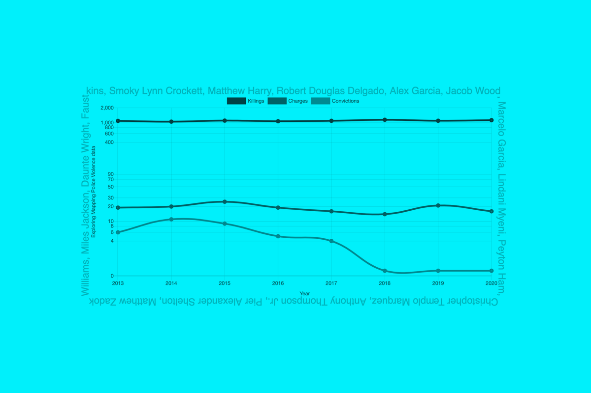

1. Download `MPVDatasetDownload.xlsx` from [mappingpoliceviolence.org](https://mappingpoliceviolence.org/).
2. Open the file, remove unnecessary columns, export to `MPVDatasetDownload.csv`.
3. Run `python data-cleanup.py` to create `data-summary.csv`.
